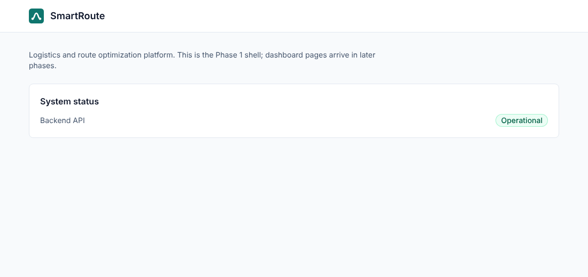

# SmartRoute

A logistics platform that assigns delivery orders to drivers, computes shortest and fastest routes on a road graph, sequences multi-stop deliveries, and streams driver movement to a dispatcher dashboard.

> **Project status: Phase 4 of 15.** Foundation, the graph algorithm core, road-data import, snapping, benchmarks and the order/fleet/warehouse domain on PostgreSQL exist. Login, routing APIs, assignment, Kafka events and the dashboard are built in later phases; see [the plan](docs/phase-0-plan.md). This README only describes what exists today.



## Problem

Delivery companies continuously decide which driver takes an order, which route to drive, and in what order to visit stops, while traffic and driver availability change. SmartRoute solves these with graph algorithms (Dijkstra, A*), heaps (Top-K driver candidates), greedy assignment and dynamic programming (exact stop ordering for small inputs), on an event-driven Spring Boot backend.

## What works today

| Area | State |
|---|---|
| Backend | Spring Boot 4 modular monolith: warehouses, drivers, vehicles, orders with a status state machine and history; Flyway schema on PostgreSQL; one JSON error format with trace ids; OpenAPI docs; fictional seed data (120 drivers, 600 orders); 56 tests on real PostgreSQL (Testcontainers). See [Phase 4](docs/phases/phase-4-domain-database.md) |
| Frontend | React + TypeScript + Vite + Tailwind shell that shows live backend health, 5 tests |
| Infrastructure | `docker compose up` starts PostgreSQL, Redis, Kafka (KRaft), backend and frontend with health-checked startup order |
| CI | GitHub Actions: backend tests, frontend lint/test/build, Docker image build |
| Road data | OSM import script (tested; real extract not yet committed, see [data/road-network](data/road-network/README.md)), CSV loader, largest-SCC cleanup, k-d tree nearest-node snapping. See [Phase 3](docs/phases/phase-3-road-network-benchmarks.md) |
| Benchmarks | JMH suite with [real results](docs/phases/phase-3-road-network-benchmarks.md#step-6-benchmarks-real-jmh-results) |
| Algorithms | Adjacency-list graph, BFS, iterative DFS, Kosaraju SCC, Dijkstra (point-to-point, one-to-many), A* with haversine heuristics, deterministic synthetic city generator; 71 unit tests. See [Phase 2](docs/phases/phase-2-graph-core.md) |

The API has no login yet; Phase 5 adds JWT authentication and roles. Redis and Kafka are running but not yet used; they are connected in Phases 6 and 9.

## Tech stack

Java 21, Spring Boot 4, Maven · PostgreSQL 17 · Redis 8 · Apache Kafka 4 (KRaft) · React 19, TypeScript, Vite, Tailwind CSS 4, Vitest · Docker Compose · GitHub Actions

## Repository layout

```
backend/
  algorithms/   pure Java algorithms module (no Spring dependency, enforced by the build)
  app/          Spring Boot application
  benchmarks/   JMH benchmarks for the algorithms
data/           road-network datasets
frontend/       React dashboard
docs/           plan, engineering decisions, per-phase notes
scripts/        data preparation scripts (later phases)
.github/        CI pipeline
```

## Local setup

Requirements: Docker with Compose v2. For running outside Docker: JDK 21 and Node 22.

```bash
cp .env.example .env          # edit passwords if you like; .env is git-ignored
docker compose up --build     # first build downloads dependencies
```

| URL | What |
|---|---|
| http://localhost:3000 | Frontend |
| http://localhost:8080/actuator/health | Backend health |
| http://localhost:8080/swagger-ui.html | API documentation (OpenAPI) |

Startup order is enforced by health checks: `postgres`, `redis`, `kafka` → `backend` → `frontend`.

### Running without Docker

```bash
docker compose up -d postgres                    # the app needs PostgreSQL
cd backend && DB_PASSWORD=change-me-local-only SPRING_PROFILES_ACTIVE=seed ./mvnw spring-boot:run -pl app -am   # API on :8080
cd frontend && npm install && npm run dev         # UI on :5173, proxies /api and /actuator to :8080
```

## Testing

```bash
cd backend && ./mvnw verify      # all backend tests (needs Docker for Testcontainers)
cd frontend && npm test          # frontend tests
python3 -m unittest discover -s scripts/osm   # data script tests
```

## Algorithms

| Algorithm | Used for | Time | Space |
|---|---|---|---|
| BFS | Fewest-hop path, k-hop neighbourhood | O(V + E) | O(V) |
| Iterative DFS + Kosaraju SCC | Find nodes cut off by one-way streets | O(V + E) | O(V + E) |
| Dijkstra (binary heap, lazy deletion) | Shortest / fastest route, one-to-many ETAs | O((V + E) log V) | O(V + E) |
| A* (haversine heuristic) | Faster point-to-point route, same optimal cost | O((V + E) log V) worst case | O(V + E) |
| 2-d tree | Snap a GPS point to the nearest road node | O(log V) average query | O(V) |

## Performance

Measured with JMH on a 4-vCPU cloud VM (synthetic 10,000-node city): a local route takes ~0.06 ms, a cross-city route ~1–2 ms; A* is up to 1.8× faster than Dijkstra on a 40k-node city; nearest-node lookup takes ~0.7 µs vs ~6 ms for a linear scan. Full tables, method and caveats: [Phase 3 benchmarks](docs/phases/phase-3-road-network-benchmarks.md#step-6-benchmarks-real-jmh-results).

## Engineering decisions

Every major decision has a reason, an alternative and a tradeoff in [docs/engineering-decisions.md](docs/engineering-decisions.md).

## Limitations

Everything listed under "What works today" is all that works. No feature from later phases should be assumed.

## License

MIT
