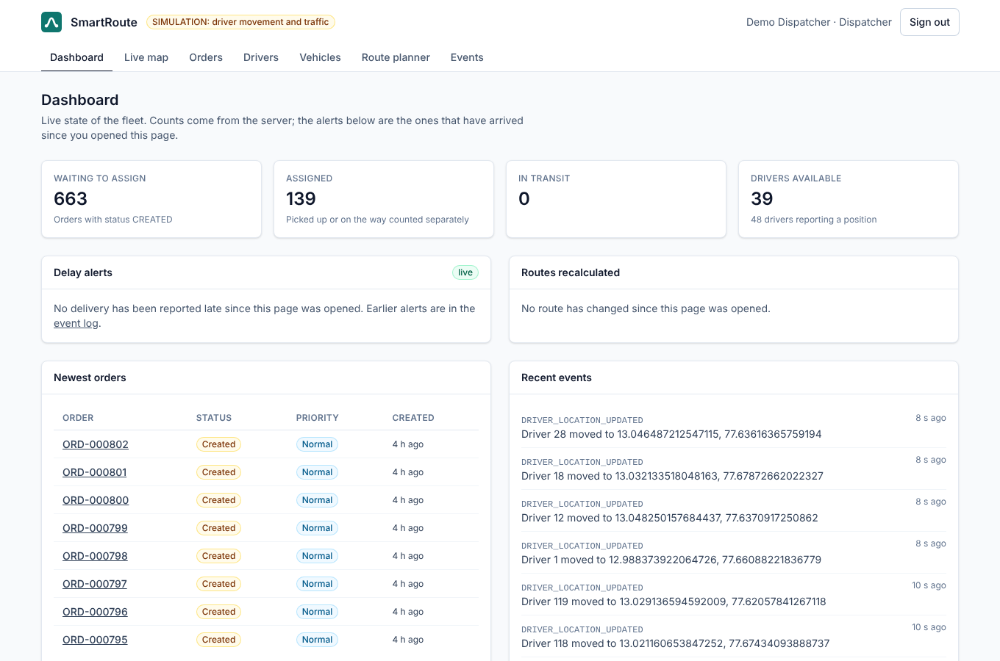

# SmartRoute

A logistics platform that assigns delivery orders to drivers, computes shortest and fastest routes on a road graph, sequences multi-stop deliveries, and streams driver movement to a dispatcher dashboard.

> **Project status: all 15 phases complete.** Foundation, the graph algorithm core, road-data import, snapping, benchmarks, the order/fleet/warehouse domain on PostgreSQL, login with role-based access, the routing API with a Redis cache, driver assignment, multi-stop optimization, domain events on Kafka, live tracking (positions, a server-sent event stream, delay alerts, recalculation on traffic changes), the dispatcher dashboard, metrics, an analytics API, a measured performance pass, the optional read-only assistant and a final quality gate (security, honesty and code-quality audits, [Phase 15](docs/phases/phase-15-quality-gate.md)) exist; see [the plan](docs/phase-0-plan.md). This README only describes what exists today.



## Problem

Delivery companies continuously decide which driver takes an order, which route to drive, and in what order to visit stops, while traffic and driver availability change. SmartRoute solves these with graph algorithms (Dijkstra, A*), heaps (Top-K driver candidates), greedy assignment and dynamic programming (exact stop ordering for small inputs), on an event-driven Spring Boot backend.

## What works today

| Area | State |
|---|---|
| Backend | Spring Boot 4 modular monolith: warehouses, drivers, vehicles, orders with a status state machine and history; Flyway schema on PostgreSQL; one JSON error format with trace ids; OpenAPI docs; fictional seed data (120 drivers, 600 orders); 313 tests in the application module, 248 of them against real PostgreSQL and Redis in Testcontainers (10 of those also against real Kafka) and 65 that need no container, plus 116 for the algorithms module. See [Phase 4](docs/phases/phase-4-domain-database.md) |
| Routing API | Shortest/fastest routes (A*, optimal) and up to 3 alternatives (heuristic) between any two points, snapped to the road network; traffic multipliers with versioned network snapshots; Redis cache-aside that keeps working when Redis is down; route history. Runs on the **synthetic** city unless a real dataset is configured. See [Phase 6](docs/phases/phase-6-routing-api.md) |
| Assignment | Driver candidates ranked by a weighted score (ETA from the road graph, workload, capacity fit, **heuristic**), manual assignment and greedy auto-dispatch, both safe against double-booking under row locks; driver delivery endpoints; weights editable by an admin. See [Phase 7](docs/phases/phase-7-assignment.md) |
| Multi-stop routes | Visiting order for up to 20 stops: exact (Held-Karp) up to 12 stops, nearest neighbour + 2-opt above, always stating which ran; arrival times with service time, stops that miss their window flagged, capacity enforced; the same for a driver's own deliveries. See [Phase 8](docs/phases/phase-8-multi-stop-optimization.md) |
| Events | Every order status change and driver position goes to Kafka through a transactional outbox: versioned envelope, per-order ordering, consumers that handle a repeated delivery once, blocking retries and a dead-letter topic per event topic; the recorded stream is readable at `/api/events`. See [Phase 9](docs/phases/phase-9-kafka-events.md) |
| Live tracking | Driver positions kept in a Redis read model fed by the Kafka stream (rebuildable, falls back to the database); a server-sent event stream at `/api/tracking/stream` that drops clients which cannot keep up; deliveries predicted to miss their window raised as alerts (threshold and growth suppression, **heuristic** — it is the sequencer's prediction, not a forecast); routes reported as recalculated when the order or duration changes, immediately after a traffic change. See [Phase 10](docs/phases/phase-10-live-tracking.md) |
| Simulators | **[SIMULATION]** Optional, off by default: drivers moved along real roads towards their drop, and random traffic jams. Every simulated position is labelled `SIMULATION` through the event payload, the read model and the stream; `/api/simulation/status` says what is running. Nothing simulated is used as a measurement. See [Phase 10](docs/phases/phase-10-live-tracking.md) |
| Observability | One access-log line per request and one correlation id that follows a request through Kafka into the consumers' log lines; optional ECS JSON logging; Prometheus metrics at `/actuator/prometheus` (admin only) with HTTP timings and five sampled domain gauges — orders waiting, deliveries active, drivers available, outbox pending and its oldest row. See [Phase 12](docs/phases/phase-12-observability-analytics.md) |
| Analytics | Read-only SQL aggregates at `/api/analytics/*`: counts and status breakdown, on-time rate over the deliveries that had a window, assignment-to-delivery percentiles, orders per day, per-driver deliveries, and predicted pickup time against what happened. Every response carries the definitions its numbers were computed with, and reports nothing rather than 0 % when there is nothing to judge. See [Phase 12](docs/phases/phase-12-observability-analytics.md) |
| Assistant (optional) | Off by default, and the only feature that calls a paid API. Answers questions about current operations by calling six **read-only** tools (warehouses, orders, order detail, driver ranking, analytics, fleet positions), and answers in three parts: facts from those tool calls, its own recommendations, and what it could not check. It has no tool that writes, which an architecture test enforces rather than the prompt. Needs `ASSISTANT_ENABLED` and `ANTHROPIC_API_KEY`; without them the API answers 503 naming the missing setting and the page says so. No live call has been made in this repository, so nothing claims how well it answers. See [Phase 14](docs/phases/phase-14-assistant.md) |
| Security | JWT login with rotating refresh tokens (HttpOnly cookie, reuse detection), BCrypt, four roles enforced on every endpoint (an architecture test fails the build if an endpoint states no rule), login rate limiting, CORS allow-list, security headers and a Content-Security-Policy, at most four live streams per user, and an API document that `API_DOCS_PUBLIC=false` restricts to admins. See [Phase 5](docs/phases/phase-5-security.md) and [Phase 15](docs/phases/phase-15-quality-gate.md) |
| Frontend | React + TypeScript + Vite + Tailwind dashboard: login, fleet dashboard, live map (Leaflet, fed by the event stream), orders with filters and creation, order detail with ranked driver candidates and one-click assign, drivers, vehicles, route planner, a driver's own deliveries, an analytics page, the assistant, the event log and an admin page; loading, empty and error states everywhere, server-side validation surfaced per field, and every heuristic labelled where it is read; 77 tests. See [Phase 11](docs/phases/phase-11-frontend.md) |
| Infrastructure | `docker compose up` starts PostgreSQL, Redis, Kafka (KRaft), backend and frontend with health-checked startup order |
| CI | GitHub Actions: backend tests, frontend dependency audit and lint/test/build, Python script tests, Docker image build; Dependabot for Maven, npm and Actions |
| Road data | OSM import script (tested; real extract not yet committed, see [data/road-network](data/road-network/README.md)), CSV loader, largest-SCC cleanup, k-d tree nearest-node snapping. See [Phase 3](docs/phases/phase-3-road-network-benchmarks.md) |
| Benchmarks | JMH suite for the algorithms and eight scripts in `scripts/perf/` for the running system: route and request latency layer by layer, multi-stop optimize, auto-dispatch, event and live-stream delay, database plans at a synthetic 100k orders, and a concurrent load test. Every number below comes from one of them; raw output in [docs/benchmarks](docs/benchmarks). See [Phase 13](docs/phases/phase-13-performance.md) |
| Algorithms | Adjacency-list graph, BFS, iterative DFS, Kosaraju SCC, Dijkstra (point-to-point, one-to-many), A* with haversine heuristics, alternative routes (penalty method), bounded-heap Top-K, exact and heuristic stop sequencing, deterministic synthetic city generator; 116 unit tests. See [Phase 2](docs/phases/phase-2-graph-core.md) |

## Deployment

The same Compose stack runs on one server behind Caddy (automatic HTTPS), with a GitHub Actions job that redeploys every green `main`. Setup, costs, measured memory and what is simulated on a public site: [docs/deployment.md](docs/deployment.md).

## Tech stack

Java 21, Spring Boot 4, Maven · PostgreSQL 17 · Redis 8 · Apache Kafka 4 (KRaft) · React 19, TypeScript, Vite, Tailwind CSS 4, Vitest · Docker Compose · GitHub Actions · Anthropic Java SDK (the optional assistant only)

## Repository layout

```
backend/
  algorithms/   pure Java algorithms module (no Spring dependency, enforced by the build)
  app/          Spring Boot application
  benchmarks/   JMH benchmarks for the algorithms
data/           road-network datasets
frontend/       React dashboard
docs/           plan, engineering decisions, per-phase notes
scripts/        osm/ data preparation, perf/ the measurement scripts behind the Performance section
.github/        CI pipeline
```

## Local setup

Requirements: Docker with Compose v2. For running outside Docker: JDK 21 and Node 22.

```bash
cp .env.example .env          # set your own passwords and JWT_SECRET; .env is git-ignored
docker compose up --build     # first build downloads dependencies
```

| URL | What |
|---|---|
| http://localhost:3000 | Frontend |
| http://localhost:8080/actuator/health | Backend health |
| http://localhost:8080/swagger-ui.html | API documentation (OpenAPI); use "Authorize" with a token from `/api/auth/login` |

With the default `seed` profile, demo logins exist for every role: `admin@smartroute.local`, `dispatcher@smartroute.local`, `viewer@smartroute.local`, `driver1@smartroute.local`, `driver2@smartroute.local`. Their password is whatever you set as `DEMO_USER_PASSWORD` in `.env`. All demo people are fictional.

```bash
curl -s localhost:3000/api/auth/login -H 'Content-Type: application/json' \
  -d '{"email":"dispatcher@smartroute.local","password":"<DEMO_USER_PASSWORD>"}'
# then: curl -H "Authorization: Bearer <accessToken>" localhost:3000/api/orders
```

Startup order is enforced by health checks: `postgres`, `redis`, `kafka` → `backend` → `frontend`.

### Running without Docker

```bash
docker compose up -d postgres                    # the app needs PostgreSQL
set -a && . ./.env && set +a                     # DB, JWT and demo passwords from .env
cd backend && DB_PASSWORD=$POSTGRES_PASSWORD SPRING_PROFILES_ACTIVE=seed ./mvnw spring-boot:run -pl app -am   # API on :8080
cd frontend && npm install && npm run dev         # UI on :5173, proxies /api and /actuator to :8080
```

## Testing

```bash
cd backend && ./mvnw verify      # all backend tests (needs Docker for Testcontainers)
cd frontend && npm test          # frontend tests
python3 -m unittest discover -s scripts/osm   # data script tests
```

## Algorithms

| Algorithm | Used for | Time | Space |
|---|---|---|---|
| BFS | Fewest-hop path, k-hop neighbourhood | O(V + E) | O(V) |
| Iterative DFS + Kosaraju SCC | Find nodes cut off by one-way streets | O(V + E) | O(V + E) |
| Dijkstra (binary heap, lazy deletion) | Shortest / fastest route, one-to-many ETAs | O((V + E) log V) | O(V + E) |
| Held-Karp (bitmask DP) | Exact visiting order for up to 16 stops | O(n²·2ⁿ) | O(n·2ⁿ) |
| Nearest neighbour + 2-opt | Visiting order above that size **[HEURISTIC]** | O(n²) per pass | O(n) |
| A* (haversine heuristic) | Faster point-to-point route, same optimal cost | O((V + E) log V) worst case | O(V + E) |
| 2-d tree | Snap a GPS point to the nearest road node | O(log V) average query | O(V) |
| Dijkstra on the reversed graph | ETA of every nearby driver to one pickup, in one search | O((V + E) log V) | O(V + E) |
| Bounded heap (Top-K) | Best k driver candidates of n | O(n log k) | O(k) |
| Greedy + priority queue | Auto-dispatch of waiting orders **[HEURISTIC]** | O(n log n + n·ranking) | O(n) |

## Performance

Measured with JMH on a 4-core Xeon (synthetic grid city), whole suite re-run in Phase 13: a local route takes 28–180 µs and a cross-city route 1.2 ms on 10,000 nodes, 7.6 ms on 40,000; A* beats Dijkstra by 1.5–1.8×, and by less as the graph grows, because a haversine heuristic has little to work with on a uniform grid. Snapping a coordinate to a node takes 0.75 µs against 5.8 ms for a linear scan (~7,700×), and one reversed Dijkstra answers 100 drivers' ETAs in 3.7 ms against 173 ms for a search per driver (46×). Full tables and the error bars: [Phase 13](docs/phases/phase-13-performance.md#algorithms-jmh-whole-suite-re-run-this-phase), method and caveats: [Phase 3](docs/phases/phase-3-road-network-benchmarks.md#step-6-benchmarks-real-jmh-results).

Multi-stop optimization: ordering 12 stops takes p50 69 ms end to end, of which 2 ms is the exact algorithm — the rest is the 2(n+1) graph searches behind it, which cost 31–54 ms whichever algorithm runs. 20 stops takes p50 110 ms exact-or-heuristic, 96 ms forced heuristic. Against the exact optimum, nearest neighbour + 2-opt averages 2 % longer (worst case 19 %) and is 700× faster at 12 stops. The figures above are the Phase 13 re-run; the original run (93 ms and 133 ms) and the method are in [Phase 8](docs/phases/phase-8-multi-stop-optimization.md#step-6-measurements), the re-run in [Phase 13](docs/phases/phase-13-performance.md).

Assignment (same machine, 120 seeded drivers): ranking the top 5 of 105 drivers on shift takes p50 18 ms / p95 27 ms, about 12 ms above a plain authenticated GET. Dispatching 100 waiting orders takes 2.1 s (21 ms each). Switching from the configured weights to ETA only ("nearest driver") used 31 drivers instead of 49 and doubled the busiest driver's load (8 deliveries against 4), while cutting mean pickup ETA from 2.8 to 2.4 min; with 400 orders the fleet saturates and the difference nearly vanishes. The driver and ETA figures here are the Phase 13 re-run ([Phase 13](docs/phases/phase-13-performance.md)); the method and the original run (52 against 30 drivers, 2.7 to 2.1 min) are in [Phase 7](docs/phases/phase-7-assignment.md#step-6-measurements).

Domain events are not instant and are not claimed to be: from the commit that changed an order to the event being readable takes p50 474 ms with the default 500 ms relay interval, and p50 59 ms when the relay polls every 50 ms — almost all of it is the wait for the next relay run, not Kafka. Re-measured in Phase 13 on the current code: p50 487 ms at the default interval. The first run: [Phase 9](docs/phases/phase-9-kafka-events.md#step-6-measurements); the Phase 13 re-run: [Phase 13](docs/phases/phase-13-performance.md).

Live tracking, measured end to end (position recorded → frame read by a browser client): p50 122 ms / p95 219 ms with the relay polling every 50 ms, p50 530 ms / p95 878 ms at the default 500 ms (Phase 13 re-run: p50 457 ms / p95 705 ms, 12.3 frames a second with the driver simulator on — the script counts frames, not drivers, so no driver count is claimed for that run). The delay is the outbox relay's interval, not Kafka, Redis or SSE — half a second behind by choice, which is why nothing here is called "real-time". The same measurement found a bug: with Spring's default single scheduler thread, a *faster* relay made the map worse (p95 5.5 s, worst case 29 s) because the relay, the tracking sweep, the heartbeat and the simulators shared one thread; `SCHEDULING_THREADS` now defaults to 4. The delay/recalculation sweep costs ~35–55 ms per driver (1.6–2.6 s for 48 drivers) and will not scale to hundreds of active drivers on one instance. The first two runs and the full reading: [Phase 10](docs/phases/phase-10-live-tracking.md#step-6-measurements); the re-run: [Phase 13](docs/phases/phase-13-performance.md).

Through the HTTP API (one sequential client, same host, 300 random trips, warm JVM): a computed fastest route takes p50 9 ms / p95 15 ms including the history write; a cached one p50 6 ms / p95 9 ms; a trivial authenticated GET is p50 4 ms. Taking one request apart layer by layer shows where that goes: 1.1 ms HTTP and Tomcat, +0.1 ms authentication, +1.1 ms a small read, +3.6 ms the cache read with 3 KB of geometry and the history row every route request writes, +2.3 ms A* itself. The algorithm is the cheapest part, which is why the Phase 0 target of a cached route at **p95 under 5 ms** is still not met: p95 is 9 ms, of which the history write is 2-3 ms, so removing it would leave about 7 ms and still miss the target. (An earlier version of this paragraph compared the 6 ms p50 against a p95 target, which made the gap look like one millisecond.) A history that can lose records is in any case a worse thing to own than three milliseconds. Measuring it also corrected an earlier claim — on a cold JVM the cache appeared to save 7 ms per request, and on a warm one it saves 3. Method, both runs and the layer table: [Phase 13](docs/phases/phase-13-performance.md).

The database had never been looked at before Phase 13, and that is where the real findings were. At the demo size every query the application still issues is under 3 ms (the two it no longer issues cost 53 and 73 ms, which is why they were removed); with 100k orders and 405k status-history rows, the analytics endpoints took 34-64 ms each, all of them sequential scans. Two indexes (`V7`) took them to 1-36 ms, one query had to be rewritten as a `JOIN LATERAL` rather than indexed (63 ms to 11 ms, with the candidate index making no difference at all), and two endpoints stopped counting whole tables on every call: the event log is now paged without a total, and the outbox's published figure is PostgreSQL's own estimate. Before/after tables, the plans, and the three measurement mistakes that had to be fixed first: [Phase 13](docs/phases/phase-13-performance.md).

Under concurrent load (`scripts/perf/load.py`, four shared cores running the backend, PostgreSQL, Redis, Kafka and the client): fresh routes scale linearly to 4 clients and reach 551 requests/s at 16, with p50 rising from 15 to 25 ms and no failures; cached routes reach 714/s at 8 clients, the order list 430/s, the analytics overview 341/s. That is this box under this load, not a capacity statement — the method and its limits are in [Phase 13](docs/phases/phase-13-performance.md#under-concurrent-load).

The dashboard was also driven in a real browser against the running stack: 124 **[SIMULATION]** driver markers on the live map with the stream open (both simulators were on, and the tile server was blocked in that run, so the markers sat on a blank basemap), A* and Held-Karp results in the planner, and the delay sweep run from the admin page. Map tiles come from OpenStreetMap and need outbound access to the tile server; routing itself runs on the configured road graph, which is the synthetic city unless a real dataset is loaded.

## Engineering decisions

Every major decision has a reason, an alternative and a tradeoff in [docs/engineering-decisions.md](docs/engineering-decisions.md).

## Limitations

Everything listed under "What works today" is all that works. Known limits, each stated where it was found:

- **One instance.** The outbox relay, the live stream and the delay sweep run on one instance by design; the sweep costs 35–55 ms per active driver and will not scale to hundreds of them. Every instance also holds the whole road graph in memory. The redesigns that would lift these are written down in [ED-78](docs/engineering-decisions.md#ed-78-known-scale-limits-and-the-redesign-that-would-lift-them-phase-15) and none of them is built.
- **Synthetic city by default.** Routing runs on a generated grid unless an OpenStreetMap extract is imported; benchmark numbers are for that grid.
- **Unmet target.** A cached route's p95 is 9 ms against the Phase 0 target of 5 ms.
- **Not measured.** Stop ordering against the naive creation order (only heuristic against exact was run), and the assistant's answer quality (no live model call has been made).
- **Simulated movement.** Driver positions in the demo come from the simulator and are labelled `SIMULATION` everywhere they appear.

## License

MIT
