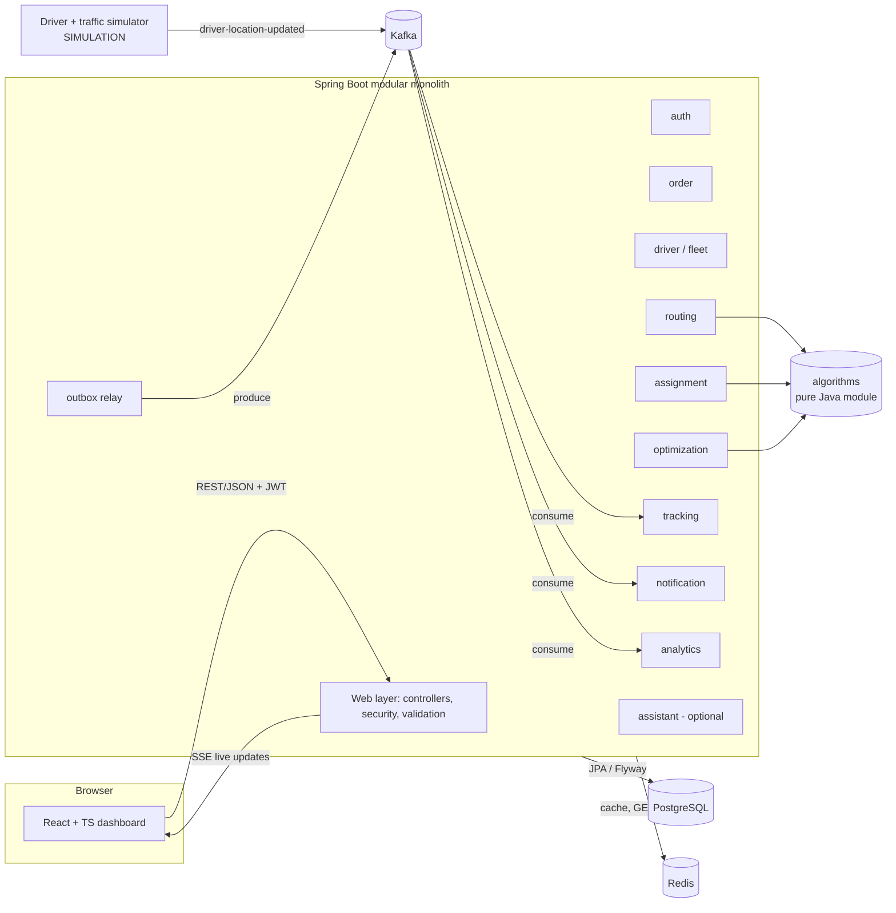
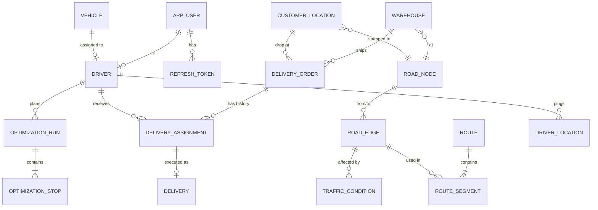

# SmartRoute — Phase 0: Product & Architecture Plan

> Status: **Draft for approval.** No implementation code is written in this phase.
> Date: 2026-10-06

SmartRoute is a logistics platform that assigns delivery orders to drivers, computes shortest/fastest routes on a road graph, sequences multi-stop deliveries, and streams live driver movement and delivery events to a dispatcher dashboard.

**Honesty labels used throughout this document**

| Label | Meaning |
|---|---|
| `[REAL]` | Actually implemented and running end to end. |
| `[SIMULATION]` | Implemented with a real event flow, but the input data is generated (e.g. GPS pings, traffic). |
| `[HEURISTIC]` | Produces a good answer fast, with no optimality guarantee. |
| `[OPTIMAL]` | Provably optimal for the stated problem and input limits. |
| `[TARGET]` | A goal we will measure later. Not a claim until a benchmark backs it. |

---

## 1. Product requirements

### 1.1 Problem
A delivery company with warehouses in one city has to continuously decide:

1. Which available driver should take a new order?
2. What is the shortest (distance) and fastest (time) route between two points?
3. In what order should a driver visit several drops?
4. What changes when traffic changes or a driver goes offline?
5. How do urgent orders get served first?

Today (in our fictional company) dispatchers do this by hand from a spreadsheet and a map. That causes long ETAs, unbalanced driver workload, and late urgent deliveries.

### 1.2 Product goal
Give dispatchers a system that makes these decisions with explainable algorithms, shows the result on a live map, and raises alerts when a delivery is at risk.

### 1.3 Success criteria (measurable, verified in later phases)
| Criterion | How we will measure it |
|---|---|
| Route results are correct | Unit tests against hand-computed graphs; Dijkstra and A* must return the same cost on every test graph. |
| Multi-stop sequencing beats naive order | Benchmark: total route distance of our heuristic vs. orders visited in creation order, and vs. the exact DP optimum for small inputs (reported gap %). |
| Assignment is balanced | Seed-data experiment: standard deviation of per-driver workload, greedy-by-score vs. "nearest driver only". |
| Live updates actually flow | A location event published to Kafka appears on the dashboard; end-to-end latency logged and reported from real runs. |
| Every number in the README is reproducible | Benchmarks and experiments are scripts in the repo. |

### 1.4 Out of product scope (stated honestly)
- No real GPS hardware or real drivers. Driver movement is a `[SIMULATION]` that publishes real Kafka events.
- No live traffic feed. Traffic is a `[SIMULATION]` that changes edge travel times.
- No payments, customer app, or billing.
- We do not claim to solve the full Vehicle Routing Problem (VRP), which is NP-hard. See §9.

---

## 2. User personas

| Persona | Role | Goals | Pain points | What SmartRoute gives them |
|---|---|---|---|---|
| **Priya, Dispatcher** | `DISPATCHER` | Get every order assigned fast; keep urgent orders on time. | Manually comparing driver distances; can't see who is overloaded. | Ranked top-K driver candidates with a score breakdown, one-click assign, live map, delay alerts. |
| **Ravi, Driver** | `DRIVER` | Know the next stop and the route; update delivery status. | Poor stop order means backtracking. | Stop sequence computed for *his own* deliveries (exact up to 12 stops, `[HEURISTIC]` above), status updates (picked up / delivered / failed). |
| **Meera, Operations Admin** | `ADMIN` | Manage users, warehouses, vehicles, scoring weights. | Changing rules requires a developer. | Admin page for users/roles and configurable assignment weights; system-event log. |
| **Arjun, Ops Analyst / Manager** | `VIEWER` | Understand performance and delays. | No single view of KPIs. | Read-only dashboard, analytics, and (optional) AI assistant that answers from real data. |

All persona names are fictional. Seed data will contain no real personal data.

---

## 3. Functional requirements

IDs are referenced by milestones in §11.

### Identity & access
- **FR-1** Users log in with email + password and receive a short-lived JWT access token and a rotating refresh token.
- **FR-2** Four roles (`ADMIN`, `DISPATCHER`, `DRIVER`, `VIEWER`) enforced on the server for every endpoint. A `DRIVER` can only read/update their own deliveries and location.

### Master data
- **FR-3** CRUD for warehouses, drivers, vehicles (type, weight/volume capacity), with validation.
- **FR-4** Load a city road network (nodes with lat/lon, directed edges with length and speed) from a versioned dataset.

### Orders & deliveries
- **FR-5** Create orders with pickup warehouse, drop location, priority (`LOW`/`NORMAL`/`HIGH`/`URGENT`), weight/volume, required vehicle type, and optional delivery time window.
- **FR-6** Order lifecycle: `CREATED → ASSIGNED → PICKED_UP → IN_TRANSIT → DELIVERED`, plus `FAILED` and `CANCELLED`. Illegal transitions are rejected.
- **FR-7** Search/filter orders by status, priority, driver, date range (paginated).

### Routing
- **FR-8** `POST /api/routes/shortest` (by distance) and `POST /api/routes/fastest` (by time, including current traffic multipliers) between two locations, returning path, distance, ETA.
- **FR-9** Up to K alternative routes for a pair of points `[HEURISTIC]`.
- **FR-10** Clear error when the destination is unreachable or a location is off the network.
- **FR-11** Persist computed routes and their segments for history (`GET /api/routes/{id}`).

### Assignment
- **FR-12** For an order, return top-K candidate drivers with a score and a per-factor breakdown (ETA, workload, capacity fit, priority).
- **FR-13** Auto-assign or dispatcher-confirmed assign. Assignment is safe under concurrent requests (no driver double-booked beyond capacity).
- **FR-14** Scoring weights are configurable by `ADMIN` without code changes.
- **FR-15** If a driver goes `OFFLINE`, their unstarted deliveries are re-queued for reassignment and an alert is raised.

### Multi-stop optimization
- **FR-16** `POST /api/routes/optimize`: given a start point and N stops, return a visiting order, total distance/time, and which algorithm produced it (exact or heuristic).
- **FR-17** Respect capacity; flag (not silently ignore) stops whose time window cannot be met.

### Real-time & events
- **FR-18** Driver location events (`driverId, lat, lon, timestamp`) flow through Kafka; the backend keeps each driver's latest position.
- **FR-19** Dashboard live map shows driver movement pushed from the server (no client-side fake numbers).
- **FR-20** Domain events (`order-created`, `order-assigned`, `delivery-started`, `delivery-completed`, `route-recalculated`, `delivery-delayed`, `driver-location-updated`) are published and consumed for notifications and analytics.
- **FR-21** A delivery predicted to miss its time window raises a `delivery-delayed` event and a dashboard alert.
- **FR-22** When traffic changes on an edge used by an active route, affected routes are recalculated.

### Analytics & AI
- **FR-23** Analytics: deliveries per status, on-time rate, average ETA error, driver utilization, assignment failures.
- **FR-24** (Optional, last milestone) AI assistant that answers ops questions by calling real backend read-only tools and labels output as FACTS / RECOMMENDATIONS / UNCERTAINTY.

---

## 4. Non-functional requirements

Numbers here are `[TARGET]`s on a developer laptop with seed data. They become claims only after a benchmark run reports them.

| Area | Requirement |
|---|---|
| **Performance** | Single route query on the city graph: p95 < 50 ms `[TARGET]`. Top-K candidate selection for one order over 100+ drivers: p95 < 100 ms `[TARGET]`. Cached route: p95 < 5 ms `[TARGET]`. |
| **Correctness** | Algorithms deterministic for the same input (tie-breaking by node id). Dijkstra and A* agree on cost in every test. |
| **Consistency** | PostgreSQL is the source of truth. Kafka events are published via a transactional outbox, so a committed order always produces its event (at-least-once), and consumers are idempotent. |
| **Availability (local)** | If Redis is down, the API still works (cache misses fall through to compute). If Kafka is down, writes still commit; the outbox drains when Kafka returns. |
| **Security** | BCrypt password hashing, JWT with short expiry, server-side RBAC, Bean Validation on every input, CORS allow-list, secure headers, rate limit on login and optimization endpoints, no secrets in Git (`.env.example` only). |
| **Observability** | Structured JSON logs with correlation ID per request (propagated into Kafka headers); Actuator health/readiness; Micrometer metrics for request latency, route computation time, cache hit rate, consumer lag, assignment failures. |
| **Testability** | Algorithms are pure Java with no Spring dependency, unit-tested in isolation. Integration tests use Testcontainers (PostgreSQL, Kafka, Redis). |
| **Maintainability** | Modular monolith with enforced module boundaries (ArchUnit tests fail the build on illegal cross-module imports). |
| **Portability** | `docker compose up` starts the full stack with health checks. |
| **Scalability (explained, not claimed)** | Stateless API instances behind a load balancer; Kafka partitions by key allow consumer scale-out; the in-memory graph is per-instance and read-only. §7.6 lists the actual limits. |

---

## 5. MVP scope

The MVP is what we must finish before calling the project "done". Everything is built in the milestones of §11.

**In the MVP**
1. Auth (JWT + refresh), 4 roles, RBAC.
2. Warehouses, drivers, vehicles, orders CRUD with validation and consistent errors.
3. Road graph loaded in memory from a versioned dataset.
4. Algorithms: adjacency-list graph, BFS, DFS (Kosaraju SCC), Dijkstra, A*, bounded heap Top-K, greedy assignment, nearest-neighbour + 2-opt sequencing, Held-Karp DP for small N.
5. Route API (shortest, fastest, alternatives, history) with Redis cache.
6. Assignment engine with configurable weights and concurrency safety.
7. Multi-stop optimization API.
8. Kafka: 7 topics, transactional outbox, idempotent consumers, retry + DLT, versioned event envelope.
9. `[SIMULATION]` driver simulator moving drivers along their actual computed routes, publishing to Kafka; traffic simulator changing edge multipliers.
10. Live map over Server-Sent Events.
11. React dashboard: Login, Dashboard, Orders, Drivers, Vehicles, Route Optimization, Live Map, Deliveries, Analytics, System Events, Admin.
12. Observability, OpenAPI docs, Docker Compose, GitHub Actions CI.
13. Benchmarks (JMH) with real reported numbers: Dijkstra vs A*, heuristic vs exact sequencing.
14. Deterministic seed data: 100+ drivers, 500+ orders, multiple warehouses, multiple vehicle types.

**Optional (only after MVP)**
- AI logistics assistant (FR-24).

---

## 6. Future scope (explicitly not built now)

| Idea | Why later |
|---|---|
| Optimal batch assignment with the Hungarian algorithm (O(n³)) | Greedy is simpler to explain first; Hungarian is a good "how would you improve it" upgrade. We may compare against it in benchmarks if time allows. |
| Full VRP with time windows (OR-Tools / metaheuristics like simulated annealing) | NP-hard; a proper solver is a project of its own. |
| Contraction Hierarchies for sub-millisecond routing | Needs heavy preprocessing; only worth it on a country-scale graph. |
| Yen's K-shortest loopless paths | Our MVP alternative-route method is a simpler penalty heuristic; Yen's gives exact K-shortest paths at a higher cost. |
| PostGIS spatial queries | Redis GEO covers "nearby drivers" for the MVP. |
| Splitting into microservices | Module boundaries are designed so Routing, Assignment and Tracking could be extracted; explained in docs, not done. |
| Real GPS ingestion (mobile app), real traffic API | Requires real devices/paid APIs. |
| Kubernetes, multi-region | Not needed to demonstrate the concepts. |

---

## 7. System architecture

### 7.1 Style: modular monolith
One Spring Boot application, split into modules with explicit public APIs. Modules talk through Java interfaces (synchronous) or domain events (asynchronous). ArchUnit tests enforce that, for example, `order` never imports `driver.internal`.

### 7.2 Container view



### 7.3 Modules and responsibilities

| Module | Owns | Public API |
|---|---|---|
| `auth` | Users, roles, JWT issue/verify, refresh tokens | `AuthService`, security filter chain |
| `order` | Orders, lifecycle state machine | `OrderService`, events `order-created` |
| `driver` (fleet) | Drivers, vehicles, availability, shifts | `DriverQueryService`, `DriverAvailabilityService` |
| `routing` | Road graph snapshot, `RouteEngine`, route history, route cache | `RouteEngine.shortest/fastest/alternatives` |
| `assignment` | Candidate selection, scoring strategy, assignment transaction | `AssignmentService` |
| `optimization` | Multi-stop sequencing | `SequenceOptimizer` |
| `tracking` | Latest driver position, delay detection, SSE push | `LocationService` |
| `notification` | Alerts from events | consumer only |
| `analytics` | Read models / KPI queries | `AnalyticsQueryService` |
| `assistant` (optional) | LLM tool-calling loop over read-only services | `AssistantService` |
| `common` | Error model, correlation ID, event envelope, time utils | shared |

### 7.4 Key flows

**Order creation → assignment**
1. `POST /api/orders` validates and saves the order and an `outbox` row in **one DB transaction**.
2. The outbox relay publishes `order-created` (key = `orderId`).
3. Auto-assign (if enabled) or a dispatcher calls `GET /api/assignments/candidates?orderId=`.
4. `AssignmentService`: Redis `GEOSEARCH` for drivers within radius → filter hard constraints → one reverse-graph Dijkstra from the pickup node to get real ETAs from all candidates → score → Top-K heap.
5. `POST /api/assignments` locks the driver row (optimistic `@Version`), re-checks capacity, saves the assignment + outbox `order-assigned`.

**Live location**
1. `[SIMULATION]` simulator walks each assigned driver along the path from `RouteEngine`, publishing `driver-location-updated` (key = `driverId`) every N seconds.
2. `tracking` consumer: drops duplicate/out-of-order events (by event id and timestamp), updates Redis `GEOADD` + hash for latest position, writes a sampled history row to PostgreSQL.
3. `tracking` pushes the update to connected dashboards over SSE.
4. If remaining ETA > time window end → `delivery-delayed` event → alert.

**Traffic change**
1. `[SIMULATION]` traffic simulator changes multipliers for some edges.
2. `routing` builds a new immutable graph snapshot (copy-on-write) and bumps `graphVersion`. Cache keys include `graphVersion`, so stale routes are never served.
3. Active routes that use a changed edge are recalculated → `route-recalculated`.

### 7.5 Why the road graph lives in memory
Running Dijkstra with SQL queries per edge would mean thousands of round trips per route. The graph is loaded once from PostgreSQL into compact arrays/adjacency lists, held as an **immutable snapshot**, and swapped atomically (`AtomicReference`) when traffic changes. Readers never lock. PostgreSQL remains the source of truth.

### 7.6 Scalability: what actually scales and what doesn't
- **Scales horizontally:** stateless REST instances; Kafka consumers in the same group split partitions.
- **Limits:** each instance holds a full graph copy (fine for a city, ~tens of MB; not for a country). Assignment concurrency relies on DB row locking, which becomes a hotspot at very high volume. Both limits and their redesign (partition by zone, routing as a separate service) go in `docs/engineering-decisions.md` — done in Phase 15 as ED-78.

### 7.7 Proposed repository structure (one change from your outline)

```
smart-route/
├── backend/
│   ├── pom.xml                 # parent (multi-module)
│   ├── algorithms/             # pure Java 17, no Spring: graph, heap, greedy, dp, optimization
│   │   ├── src/main/java/com/smartroute/algorithms/...
│   │   ├── src/test/java/...   # unit tests
│   │   └── src/jmh/java/...    # JMH benchmarks
│   ├── app/                    # Spring Boot application
│   │   └── src/main/java/com/smartroute/{auth,order,driver,routing,assignment,
│   │                                      optimization,tracking,notification,
│   │                                      analytics,assistant,common,config}
│   └── simulator/              # [SIMULATION] driver + traffic event generator
├── frontend/                   # React + TS + Vite + Tailwind
├── data/                       # road-network dataset + seed generator inputs
├── docs/                       # architecture, ADRs (engineering-decisions.md), API, benchmarks
├── scripts/
├── .github/workflows/ci.yml
├── docker-compose.yml
├── .env.example
├── README.md, LICENSE, .gitignore
```

**Change and reason:** your outline had both a top-level `algorithms/` folder and `com/smartroute/algorithms/` inside the backend. I'm proposing a single Maven module `backend/algorithms` instead. Being a separate module with **no Spring dependency** means the compiler guarantees the algorithms are framework-independent, their tests run in milliseconds, and JMH benchmarks live next to them. The simulator is a separate module so it is obviously not part of the "real" platform.

---

## 8. Technology justification

Format: Decision / Reason / Alternative / Tradeoff. These seed `docs/engineering-decisions.md`.

| Decision | Reason | Alternative | Tradeoff |
|---|---|---|---|
| **Java 21 + Spring Boot 4** | Industry standard for backend roles; mature security, data, Kafka, validation, Actuator. | Go, Node/NestJS | More boilerplate and memory than Go; worth it for the target job market. |
| **Modular monolith** | One deployable, one DB, easy local dev and testing; boundaries still teach service design. | Microservices | Can't scale modules independently; acceptable at this size and explained as a future step. |
| **PostgreSQL** | Relational data with strong constraints (orders↔drivers↔assignments), transactions for assignment and outbox, rich indexing (partial, composite). | MySQL; MongoDB | MySQL would also work; Postgres has better partial indexes and JSONB for event payloads. Mongo loses FK/transaction guarantees we need. |
| **Flyway** | Plain SQL migrations, easy to read in interviews, versioned in Git. | Liquibase | Liquibase is more flexible (XML/YAML, rollbacks); not needed here. |
| **Redis** | (1) `GEOSEARCH` for "drivers near this pickup" (2) cache-aside for repeated route queries keyed by graph version (3) latest driver position (hot, overwritten constantly) (4) rate-limit counters. Each use is a real hot path. | Caffeine (in-process); PostGIS | Caffeine is faster but per-instance and not shared; PostGIS is great for spatial queries but slower for constantly-overwritten positions. Redis is an extra moving part, so the app must degrade gracefully when it's down. |
| **Kafka** | Durable, replayable event log; per-key ordering (per driver, per order); consumer groups decouple tracking, notification, analytics from the write path. | RabbitMQ; Spring `ApplicationEvent` | RabbitMQ is simpler for task queues but weaker for replay and partitioned ordering. In-process events lose durability. Kafka is heavier to run (KRaft single node locally). |
| **Transactional outbox** | Avoids the dual-write bug (DB commit succeeds, Kafka send fails, or vice versa). | Direct `kafkaTemplate.send` after commit; Debezium CDC | Direct send can lose events. Debezium is the production-grade version but adds a whole service; a polling relay is enough here. Costs a little latency (poll interval). |
| **SSE for live map** | Server→browser only; plain HTTP, auto-reconnect, works with JWT via a short-lived ticket. | WebSocket/STOMP; polling | WebSocket is bidirectional, which we don't need. Polling adds latency and load. |
| **REST + OpenAPI** | Simple, cacheable, universally understood; Swagger UI for docs. | GraphQL; gRPC | GraphQL helps flexible dashboards but adds complexity; gRPC is for service-to-service. |
| **JWT access + rotating refresh token** | Stateless auth for the API; refresh tokens stored hashed in DB so they can be revoked. | Server sessions | Sessions are simpler to revoke but need sticky sessions or a shared store. JWT can't be revoked before expiry, so access tokens are short (~15 min). |
| **React + TypeScript + Vite + Tailwind** | Industry standard, typed API contracts, fast builds. | Angular; Next.js | Next.js SSR isn't needed for an authenticated dashboard. |
| **TanStack Query** (frontend) | Handles loading/error/cache states consistently. | Redux | Redux is overkill for mostly server state. |
| **Leaflet + OpenStreetMap tiles** | Free, no API key, simple. | Google Maps, Mapbox | Need keys/billing. |
| **Testcontainers** | Integration tests against the real Postgres/Kafka/Redis instead of H2 or mocks. | H2, embedded Kafka | Slower tests, needs Docker in CI (GitHub runners have it). |
| **JMH** | Correct JVM microbenchmarks (warm-up, JIT effects). | `System.nanoTime` loops | JMH is more setup but avoids misleading numbers. |
| **GitHub Actions** | Free for public repos, lives with the code. | Jenkins, GitLab CI | — |

### Road network data (decision needed from you)
Routes must line up with streets on the map, otherwise the demo looks fake. Proposal:
- **Real road extract** for a small area of one city from OpenStreetMap, converted once by a script in `scripts/` into a nodes/edges CSV committed under `data/` (with ODbL attribution). Edge speed comes from road class / `maxspeed`. Expected size: roughly 5k–30k nodes for a district (to be confirmed after export).
- **Synthetic grid generator** (deterministic, seeded) for unit tests and scaling benchmarks.
- Default city if you have no preference: a central area of **Bengaluru**.

---

## 9. DSA mapping

Every algorithm below solves a specific product problem. Complexities are the expected ones for the planned implementation; each will be re-verified against the actual code in its phase. V = nodes, E = edges.

| # | Algorithm / DS | Product problem it solves | Planned complexity | Guarantee |
|---|---|---|---|---|
| A | **Adjacency list** (`int`-indexed arrays of edges) | Sparse road graph (each intersection has ~2–4 roads). | Space O(V+E); neighbours of u in O(deg u). | — |
| B | **BFS** | (1) Hop-limited neighbourhood: "nodes within k road segments" for snapping/zone queries. (2) Fewest-turns path where every segment counts equally. Not used for weighted routes, because BFS ignores edge weights. | O(V+E) time, O(V) space. | Optimal for unweighted hop count. |
| C | **DFS → Kosaraju SCC** | Validate the road network at load: in a directed graph with one-way streets, some nodes may be unreachable or dead ends. We keep the largest strongly connected component and report/snap the rest, so "unreachable" errors are rare and explainable. Iterative DFS to avoid stack overflow on large graphs. | O(V+E) time, O(V+E) space (transpose graph). | Exact. |
| D | **Dijkstra** (binary heap, lazy deletion) | Shortest-distance and fastest-time routes (same algorithm, different weight function). Also **one-to-many**: one run on the reversed graph from a pickup gives ETAs from *all* candidate drivers at once, with early stop once all candidates are settled. | O((V+E) log V) time with `java.util.PriorityQueue` lazy deletion (heap holds up to O(E) entries, and log E = O(log V)); O(V+E) space. Requires non-negative weights (validated). | Optimal. |
| E | **A\*** | Faster point-to-point query. Heuristic: haversine distance (shortest mode) or haversine / max network speed (fastest mode). Both never overestimate, so A* stays optimal. | Worst case same as Dijkstra; in practice explores fewer nodes. How many fewer is measured, not assumed. | Optimal with an admissible, consistent heuristic (tested: A* cost == Dijkstra cost on every test). |
| F | **Priority queue / heap** | Dijkstra/A* frontier; dispatch queue ordering pending orders by (priority, deadline, createdAt). | O(log n) insert/poll. | — |
| G | **Top-K with bounded heap** | Best K driver candidates out of N; K alternative routes ranked by cost. Size-K min-heap keeps only the best K. | O(N log K) time, O(K) space (vs O(N log N) for full sort). | Exact top-K. |
| H | **Greedy assignment** | Orders taken from the dispatch heap (most urgent first); each gets the best-scoring feasible driver. | O(M · (candidate search)) for M orders. | `[HEURISTIC]`: locally best, not globally optimal. Hungarian algorithm is the optimal comparison (future scope). |
| I | **Nearest neighbour + 2-opt** | Sequencing N stops for one driver. Build an N×N travel-time matrix (N Dijkstra runs), greedy NN tour, then 2-opt removes crossing edges. | Matrix: O(N·(V+E) log V). NN: O(N²). 2-opt: O(N²) per pass, capped passes. | `[HEURISTIC]`. |
| J | **Held-Karp dynamic programming** | Exact best stop order when N is small (a driver often has ≤ 10–12 stops). Gives us a real optimum to measure the heuristic's gap against. | O(N²·2ᴺ) time, O(N·2ᴺ) space. Cutoff N ≈ 12, final value set by measurement. | `[OPTIMAL]` for N ≤ cutoff (open path from start, no time windows). |
| K | **Alternative routes (penalty method)** | Offer 2–3 different routes: rerun Dijkstra with edges of previous routes penalized, keep results that differ enough. | K × Dijkstra. | `[HEURISTIC]`. Yen's algorithm (exact K-shortest) is future scope. |
| L | **Hash map / set** | Idempotency (processed event IDs), node-id → index lookup, route cache keys. | O(1) average. | — |

**Not used on purpose:** Bellman-Ford (no negative weights on roads), Floyd-Warshall (O(V³) all-pairs is wasteful when we only need a few sources), Union-Find (SCC is the right tool for a *directed* graph; Union-Find only handles undirected connectivity).

**Assignment scoring (configurable, explained)**
1. Hard filters (must pass): driver `AVAILABLE`/on shift, vehicle type compatible, remaining capacity ≥ order weight/volume.
2. Soft score (lower is better), each factor normalized to [0,1]:
   `score = w_eta·ETA + w_load·workload + w_fit·capacityWaste + w_dist·deadheadDistance`, with an urgency term that increases the weight on ETA for `URGENT`/`HIGH` orders.
3. Weights live in a DB table edited by `ADMIN`, behind a `ScoringStrategy` interface. Default values will be chosen by an experiment on seed data (on-time rate vs workload spread), with the result documented, not picked arbitrarily.

**Time windows:** feasibility is checked after sequencing; infeasible stops are flagged with the reason. A solver that optimizes *with* time windows is the VRPTW, which is future scope.

---

## 10. Database entities

PostgreSQL, schema managed by Flyway (`V1__...sql`). All tables have `id BIGINT GENERATED ALWAYS AS IDENTITY` (or UUID for events), `created_at`, `updated_at`, and `version` (optimistic locking) where rows are updated concurrently.

### 10.1 Entities

| Entity | Purpose | Key columns | Notes |
|---|---|---|---|
| `app_user` | Login identity | email (unique), password_hash, role, enabled | One role per user keeps RBAC simple. |
| `refresh_token` | Revocable sessions | user_id FK, token_hash (unique), expires_at, revoked_at | Stores a hash, never the raw token. |
| `warehouse` | Pickup hubs | name, node_id FK, address, active | |
| `vehicle` | Fleet | plate (unique), type (`BIKE`/`VAN`/`TRUCK`), max_weight_kg, max_volume_m3, status | |
| `driver` | Driver profile | user_id FK (unique), vehicle_id FK (unique, nullable), status (`AVAILABLE`/`BUSY`/`OFFLINE`/`ON_BREAK`), home_warehouse_id, current_load_kg, active_delivery_count, version | `version` for safe concurrent assignment. |
| `road_node` | Graph vertex (intersection) | lat, lon, dataset_version | |
| `road_edge` | Directed road segment | from_node, to_node FK, length_m, base_speed_kmh, road_class, one_way, dataset_version | Loaded into memory; DB is the source of truth. |
| `traffic_condition` | `[SIMULATION]` current multiplier per edge | edge_id FK, multiplier, valid_from, valid_to, source | Separate table so base data is immutable. |
| `customer_location` | Drop addresses | label, lat, lon, snapped_node_id FK | Snapped to nearest graph node at insert. |
| `delivery_order` | Customer order (`order` is a SQL keyword) | code (unique), warehouse_id, drop_location_id, priority, status, weight_kg, volume_m3, required_vehicle_type, window_start, window_end, created_by, version | |
| `delivery_assignment` | Order ↔ driver decision | order_id FK, driver_id FK, score, score_breakdown JSONB, assigned_by, strategy, assigned_at, status (`ACTIVE`/`REASSIGNED`/`CANCELLED`) | Keeps reassignment history; partial unique index ensures one `ACTIVE` assignment per order. |
| `delivery` | Execution of an assignment | assignment_id FK, picked_up_at, delivered_at, eta_at, failure_reason, status | Separate from order so ETA error and actual timings are explicit. |
| `route` | Computed route | from_node, to_node, mode (`SHORTEST`/`FASTEST`), algorithm, total_distance_m, total_time_s, graph_version, compute_ms, requested_by | `compute_ms` gives real latency data for analytics. |
| `route_segment` | Ordered steps of a route | route_id FK, seq, edge_id FK, distance_m, time_s | |
| `optimization_run` | Multi-stop request + result | driver_id, input JSONB, algorithm (`HELD_KARP`/`NN_2OPT`), total_distance_m, total_time_s, is_optimal, compute_ms | `is_optimal` makes the honesty label part of the data. |
| `optimization_stop` | Ordered stops in a run | run_id FK, seq, order_id FK, eta, feasible, reason | |
| `driver_location` | Sampled location history | driver_id, lat, lon, recorded_at, event_id | Latest position lives in Redis; DB keeps sampled history. Candidate for monthly partitioning (future). |
| `outbox_event` | Transactional outbox | id UUID, aggregate_type, aggregate_id, event_type, event_version, payload JSONB, created_at, published_at | |
| `processed_event` | Consumer idempotency | consumer_group + event_id (PK), processed_at | Insert fails on duplicate → skip. |
| `notification` | Alerts | type, severity, order_id, driver_id, message, read_at | |
| `scoring_config` | Assignment weights | name, weights JSONB, active, updated_by, version | |
| `audit_log` | Who changed what | actor_id, action, entity, entity_id, details JSONB, at | Admin actions and assignment overrides. |

`Location` from your list is split into `road_node` (graph) and `customer_location` (address snapped to the graph). `DeliveryEvent` is represented by `outbox_event` (outgoing) and the Kafka topics; persisting every incoming event again would duplicate Kafka.

### 10.2 ER diagram (core)



### 10.3 Planned indexes (and the query each serves)

| Index | Serves |
|---|---|
| `delivery_order (status, priority DESC, created_at)` | Dispatch queue: unassigned orders, most urgent first. |
| Partial `delivery_order (window_end) WHERE status IN ('ASSIGNED','IN_TRANSIT')` | Delay detection scans only active orders. |
| `driver (status) WHERE status = 'AVAILABLE'` (partial) | Availability lookups stay small as the fleet grows. |
| Unique partial `delivery_assignment (order_id) WHERE status = 'ACTIVE'` | DB-level guarantee: never two active assignments for one order. |
| `delivery_assignment (driver_id, assigned_at DESC)` | Driver's delivery history. |
| `driver_location (driver_id, recorded_at DESC)` | Location history/replay per driver. |
| `route (from_node, to_node, mode, graph_version)` | Route history lookups. |
| `outbox_event (created_at) WHERE published_at IS NULL` | Relay polls only unpublished events. |
| `road_edge (from_node)` | Graph load (also used by snapping queries). |

Each index will be checked with `EXPLAIN ANALYZE` on seed data in the DB phase; indexes that don't help get removed.

### 10.4 Migration strategy
- Flyway, versioned SQL files `V{n}__description.sql`, never edited after merge; changes go in new migrations.
- Seed data is generated by a deterministic Java seeder (fixed random seed) behind a `seed` Spring profile, not by migrations, so production-like DBs stay clean.
- Testcontainers runs the same migrations in integration tests, so schema drift is caught in CI.

---

## 11. Development milestones

Each phase follows your 10-step process (explain → architecture → DSA → contracts → implement → test → review → fix → commit → docs) and ends with interview questions you answer before we move on.

| Phase | Deliverable | Key FRs | DSA / concepts you'll learn |
|---|---|---|---|
| **1. Foundation** | Repo, Maven multi-module skeleton, React skeleton, Docker Compose (Postgres, Redis, Kafka KRaft) with health checks, CI pipeline, `.env.example`, README skeleton, ADR file. | — | Build tooling, CI, Docker networking. |
| **2. Graph core** | `algorithms` module: graph, BFS, iterative DFS + Kosaraju SCC, Dijkstra, A*, with full edge-case tests. Synthetic graph generator. | FR-4, FR-8 (engine only) | Graph representation, traversal, shortest paths, heuristics, admissibility. |
| **3. Road network + routing data** | OSM extract script, dataset load, SCC validation, nearest-node snapping, first JMH benchmark Dijkstra vs A* with real numbers. | FR-4, FR-10 | Spatial snapping, benchmarking methodology. |
| **4. Domain + database** | Flyway schema, JPA entities, repositories, CRUD APIs for warehouses/vehicles/drivers/orders, order state machine, global error handler, OpenAPI, deterministic seeder. | FR-3, FR-5–7 | Normalization, indexes, transactions, state machines. |
| **5. Security** | JWT + refresh rotation, BCrypt, RBAC, CORS, secure headers, rate limiting, security tests. | FR-1, FR-2 | Auth flows, token revocation trade-offs. |
| **6. Route Engine API + Redis** | `RouteEngine`, shortest/fastest/alternatives/history endpoints, graph snapshot swapping, cache-aside with graph-version keys, cache metrics. | FR-8–11 | Caching, invalidation, immutability, concurrency without locks. |
| **7. Assignment engine** | Redis GEO candidate search, one-to-many reverse Dijkstra, Top-K heap, scoring strategy + config, greedy dispatch queue, concurrent-safe assignment, offline-driver reassignment. | FR-12–15 | Heaps, Top-K, greedy, optimistic locking, race conditions. |
| **8. Multi-stop optimization** | Distance matrix, NN + 2-opt, Held-Karp, capacity/time-window checks, `optimize` API, benchmark: heuristic gap vs exact. | FR-16, FR-17 | Bitmask DP, NP-hardness, heuristics vs optimality. |
| **9. Kafka events** | Event envelope (id, type, version, correlationId), outbox relay, producers/consumers, idempotency, retries with backoff, DLT, Testcontainers Kafka tests. | FR-20 | Partitions, ordering, consumer groups, at-least-once, dual writes. |
| **10. Real-time tracking** | `[SIMULATION]` driver + traffic simulators, location consumer → Redis, SSE stream, delay detection, route recalculation on traffic change. | FR-18, 19, 21, 22 | Event-driven design, back-pressure, out-of-order events. |
| **11. Frontend** | Design system components, all 11 pages (13 by Phase 14: the analytics and assistant pages were added later), Leaflet live map, loading/error/empty states, form validation, frontend tests. | FR-19, all UI | React data fetching, state, accessibility. |
| **12. Observability + analytics** | Correlation IDs, JSON logs, Micrometer metrics, analytics endpoints and page. | FR-23 | Metrics design, percentiles. |
| **13. Performance pass** | Full benchmark suite (route, assignment, DB queries, cache), README performance section from real runs. | — | Profiling, measurement honesty. |
| **14. AI assistant (optional)** | Tool-calling agent over read-only services; FACTS / RECOMMENDATIONS / UNCERTAINTY output; disabled cleanly without an API key; tests with recorded tool results. | FR-24 | LLM tool use, grounding, prompt design. |
| **15. Quality gate** | Full audit (§39 of your brief), fixes, final README, resume bullets, pitches, interview prep. | — | — |

---

## 12. Open questions for your approval

1. **Road network:** real OpenStreetMap extract of a small area, plus a synthetic generator for tests? (Recommended.) Default city: central **Bengaluru** unless you name another.
2. **Repository layout:** one `backend/algorithms` Maven module instead of a top-level `algorithms/` folder? (Recommended.)
3. **GitHub repo:** Phase 1 needs a repository. Create an empty repo (e.g. `smart-route`) on your GitHub account and connect it to this project, or tell me its name.
