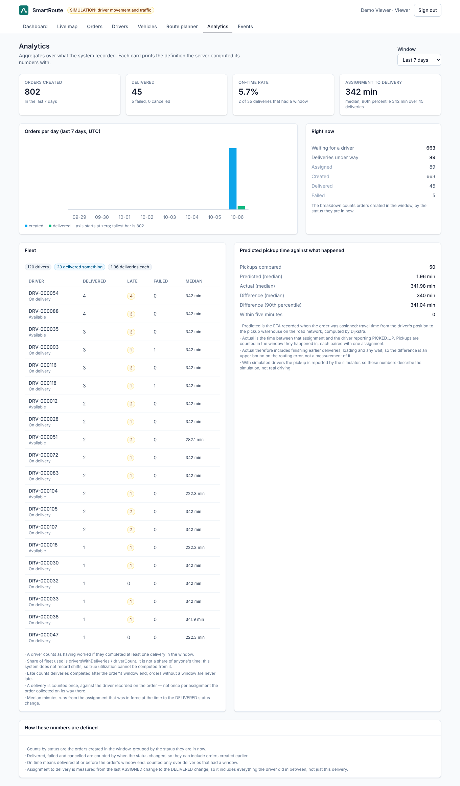

# Phase 12: Observability and analytics — one id per request, gauges, and numbers that carry their definition

## STEP 1: What we built

| Piece | Purpose |
|---|---|
| `observability.RequestLogFilter` | One access-log line per request on `com.smartroute.access`: method, path, status, duration, with the correlation id and the user id in the MDC |
| `observability.DomainMetrics` | Five gauges about the business, sampled on a timer: orders waiting, deliveries active, drivers available, outbox pending, oldest outbox row |
| `events.EventConsumers` (changed) | Restores the correlation id from the event envelope, so a log line written by a consumer carries the id of the request that caused it |
| `/actuator/prometheus` | Micrometer's Prometheus endpoint, behind `ROLE_ADMIN`, with `application` and `environment` tags and histogram buckets on `http.server.requests` |
| `analytics.AnalyticsService` | Read-only SQL aggregates: overview, throughput per day, fleet usage per driver, predicted pickup time against what happened |
| `analytics.AnalyticsController` | `GET /api/analytics/{overview,throughput,fleet,eta-accuracy}`, staff or viewer, `days` between 1 and 90 |
| `analytics.AnalyticsResponses` | The response records — every one of them ends with a `definitions` list |
| `frontend/src/pages/AnalyticsPage.tsx` | The page: four headline numbers, a bar chart per day, the fleet table, the ETA comparison, and under each card the definitions the server sent |

Two Phase 11 contract bugs were also fixed here, both found by reading the backend enums rather than by a test: the Drivers page offered driver statuses that do not exist (`BUSY`, `BREAK` instead of `ON_DELIVERY`, `ON_BREAK`), and the Deliveries page offered `PICKED_UP → DELIVERED`, which the server rejects.

## STEP 2: Architecture

```
request
  │  CorrelationIdFilter (Phase 5)           X-Request-Id, or a new UUID → MDC[traceId]
  │  Spring Security                          authentication → MDC[userId]
  │  RequestLogFilter                         times the request, logs one line after it
  ▼
controller … service … outbox row            the envelope stores correlationId (Phase 9)
  │
  ▼  Kafka
EventConsumers
  │  MDC[traceId] = envelope.correlationId()  the same id, on the other side of the hop
  ├─ the work (event log, live feed, …)
  └─ finally MDC.remove                      a pooled consumer thread must not keep it

scrape                                       sampled every 30 s, not per scrape
  GET /actuator/prometheus  (ROLE_ADMIN)  ◀── DomainMetrics.sample() → 5 gauges
                                              http.server.requests (timer + histogram)
                                              smartroute_* counters from Phases 8–10
```

```
GET /api/analytics/overview?days=7
  │  @PreAuthorize staff or viewer, days ∈ [1, 90]
  ▼
AnalyticsService (@Transactional(readOnly = true), JdbcTemplate)
  ├─ delivery_order            counts by status, waiting now, active now
  ├─ order_status_history      what happened in the window, and when
  ├─ + delivery_order.driver_id   who it is attributed to
  └─ + assignment              the ETA that was in force at the time
  ▼
Overview / ThroughputDay[] / FleetUsage / EtaAccuracy      each with definitions[]
```

## STEP 3: Design decisions explained

### 3.1 Every number travels with the sentence that defines it
`definitions` is part of the response, not a tooltip in the frontend. "On-time rate" means whatever the SQL says it means, and the SQL is the only place that knows the denominator is *deliveries that had a window*. Writing the definition next to the query means a changed query changes the printed definition. See ED-58.

### 3.2 A rate with no denominator is not reported at all
`onTimeRate` is `null`, not `0.0`, when nothing in the window had a deadline, and the page prints "no data" with the reason. The same holds for percentiles with zero samples. An invented zero reads as "we were never on time".

### 3.3 Percentiles, not an average
`assignedToDeliveredMinutes` reports samples, p50, p90 and the mean together. One mean over delivery times hides the shape completely: the p90 is the number a dispatcher cares about, and `samples` is what says whether either is worth reading.

### 3.4 A delivery is attributed to the driver on the order, not to its assignment rows
This is the bug the real data found, and it is the most interesting thing in this phase. Reassignment and the auto-dispatch retries leave several `assignment` rows on one order — 1,953 rows for 388 orders in the demo database. The first fleet query joined `assignment` to `order_status_history`, so it counted one delivery once per assignment row, and reported a driver with 24 deliveries on a day the whole fleet delivered 45. The query now counts a completion once, against `delivery_order.driver_id`, and picks the single assignment in force at the time with a correlated `ORDER BY created_at DESC, id DESC LIMIT 1`. After the fix: 23 drivers with deliveries, 1.96 each, highest 4. `AnalyticsApiTest.aDeliveryIsCountedOnceEvenWhenItsOrderWasAssignedSeveralTimes` locks it. See ED-59.

### 3.5 The ETA comparison is labelled an upper bound, because that is what it is
"Actual" is the time from assignment to the driver reporting `PICKED_UP`. That includes finishing earlier deliveries, loading and any waiting, none of which the routing ETA ever claimed to predict. So the difference is an upper bound on the routing error, and the response says so. See ED-60.

### 3.6 Gauges are sampled on a timer, not computed per scrape
`DomainMetrics.sample()` runs every 30 s (`smartroute.metrics.sample-interval`) and stores the values a Micrometer gauge reads. A gauge whose lambda runs a `count(*)` would let anyone scraping the endpoint decide how often five queries hit the database. See ED-61.

### 3.7 The metrics endpoint is admin-only
`/actuator/prometheus` and `/actuator/metrics/**` require `ROLE_ADMIN`; `/actuator/health` stays public so probes keep working. Metrics are not secrets but they are an inventory: order volumes, fleet size, URI templates, outbox depth. See ED-62.

### 3.8 One access-log line per request, written last, and not for everything
The filter runs at the end of the chain (`LOWEST_PRECEDENCE - 10`) so the line carries the real status after security and the exception handler have had their say. `/actuator/health`, `/actuator/prometheus` and `/api/tracking/stream` are excluded: the first two are scraped every few seconds, and the third is a connection that stays open for minutes, so its line would be written once at disconnect with a meaningless duration.

## STEP 4: Contracts

| Endpoint | Who | Returns |
|---|---|---|
| `GET /api/analytics/overview?days=7` | staff or viewer | counts, waiting/active now, on-time rate (nullable), assignment→delivery distribution, definitions |
| `GET /api/analytics/throughput?days=7` | staff or viewer | one row per UTC day including the empty ones |
| `GET /api/analytics/fleet?days=7` | staff or viewer | fleet size, drivers who worked, deliveries each, per-driver table, definitions |
| `GET /api/analytics/eta-accuracy?days=7` | staff or viewer | samples, predicted/actual medians, median and p90 difference, within five minutes, definitions |
| `GET /actuator/prometheus` | admin | Prometheus text format |
| `GET /actuator/health` | anyone | unchanged |

`days` outside 1–90 is a 400. A driver's token gets a 403 on all four analytics endpoints: a driver has no reason to read the fleet's performance table.

## STEP 5: Tests (389 backend, 69 frontend; 18 + 13 new)

| Test | What it pins down |
|---|---|
| `ObservabilityTest` (8) | the response id and the log line carry the same id; a client-supplied id is reused; **the id survives the Kafka hop**; the gauges report what is in the database; metrics are admin-only; health is public; the HTTP timer records the status; the stream and the probes are not logged |
| `AnalyticsApiTest` (10) | the overview counts and says what on-time means; percentiles rather than one average; an order without a window is neither on time nor late; fleet size is separate from drivers who worked; **a delivery is counted once however many times it was assigned**; throughput includes quiet days; the ETA comparison; an empty window reports nothing rather than 0 %; viewers yes, drivers no; `days` is validated |
| `AnalyticsPage.test.tsx` (9) | the headline numbers with their denominators; the server's definitions are printed; "no data" instead of 0 %; the chart's axis starts at zero and names its tallest bar; empty chart and empty ETA states; the per-driver table with a missing median; changing the window refetches all four |
| `DriversPage.test.tsx` (4) | **the status filter offers exactly the four values of the `DriverStatus` enum**; server-side filtering; "never reported"; a viewer gets no status control |

The access-log tests attach a logback `ListAppender` to `com.smartroute.access` and assert on the captured events, so they test the log line as a contract rather than scraping stdout.

## STEP 6: Checked against the running stack

The suite uses Testcontainers and stubs, so this was also run against the real stack (`docker compose`, both simulators on, ~800 seeded orders, 120 drivers) with the dashboard in headless Chromium:

| Checked | Observed |
|---|---|
| ECS JSON logs | `LOGGING_STRUCTURED_FORMAT_CONSOLE=ecs` produced one JSON object per line with `trace.id` and `user.id` |
| `/actuator/prometheus` anonymously | 401 |
| `/actuator/prometheus` with an admin token | `smartroute_orders_waiting 663.0`, `smartroute_deliveries_active 105.0`, `smartroute_outbox_pending 37.0`, `smartroute_tracking_delays_reported_total 4.0` |
| Correlation id across Kafka | the consumer's log lines carried the producing request's id |
| `/api/analytics/overview?days=7` | 802 created, 45 delivered, 5 failed, on-time 2 of 35 with a window (5.7 %), assignment→delivery p50 342 min |
| `/api/analytics/fleet?days=7` | 120 drivers, 23 delivered something (19.2 % of the fleet), 1.96 each, highest 4 |
| `/api/analytics/eta-accuracy?days=7` | 50 pickups compared, predicted median 2.0 min, actual median 342 min |
| Analytics page |  |

**The honest reading of those demo numbers.** They are not a measurement of the routing engine, and the page should not be read as one. The seeded orders were bulk-completed in one go hours after they were created, so "assignment to delivery" and "actual pickup time" are both dominated by how long the fixture sat in the database — which is why the medians are 342 minutes on the nose and the predicted-vs-actual gap is 340 minutes. What these numbers do demonstrate is that the queries aggregate what was recorded, and that the two of them agree with each other (23 × 1.96 = 45 deliveries, the same 45 the overview counts). A real measurement of ETA accuracy needs deliveries that happened in something like real time; Phase 13 measures the routing engine directly instead.

## STEP 7: Review notes

- The analytics queries are raw SQL through `JdbcTemplate`, not JPA. These are aggregates with CTEs, `percentile_cont` and a correlated subquery; expressing them as JPQL or Criteria would be longer and would still be SQL underneath, and the entity model has no use for the result shapes.
- `AnalyticsService` is `@Transactional(readOnly = true)` and touches nothing. The page it feeds is deliberately unable to change anything.
- Both fixed Phase 11 bugs came from reading the enums the backend serves rather than from a failing test, which is the useful lesson: a frontend test with a hand-written fixture happily locks in the wrong contract. `DriversPage.test.tsx` now asserts the four enum values explicitly so the next drift fails a test.
- What is not here: tracing (no OpenTelemetry exporter, only a correlation id), alerting rules, and a Grafana dashboard. The endpoint a Prometheus server would scrape exists and is tested; the server is not part of this repo.

## Interview questions

1. A request causes an event, the event is consumed 300 ms later on another thread, and the consumer logs a warning. How do you get the original request's id onto that log line, and why can you not simply leave it in the MDC?
2. Why is `onTimeRate` nullable rather than `0.0` when nothing in the window had a delivery window? What goes wrong downstream if it is zero?
3. Your fleet report says one driver delivered 24 orders on a day the fleet delivered 45. The data is not corrupt. What is the most likely cause, and how would you find it in SQL?
4. What is the difference between `shareOfFleetUsed` here and "driver utilization" as a logistics company would mean it? Which one is this, and why does the API return a sentence saying so?
5. Why is "actual pickup time minus predicted ETA" an upper bound on the routing error rather than the routing error?
6. `DomainMetrics` samples on a timer instead of computing inside the gauge lambda. What does that trade away, and when would the lambda be the right choice?
7. Why does the access-log filter run with `LOWEST_PRECEDENCE - 10` rather than first in the chain?
8. Why is `/actuator/prometheus` behind a role when it contains no personal data?
9. Why exclude the SSE endpoint from the access log, but not from the HTTP timer?
10. The report's p50 and p90 are both exactly 342 minutes. What does that tell you about the data, before you read anything else on the page?
