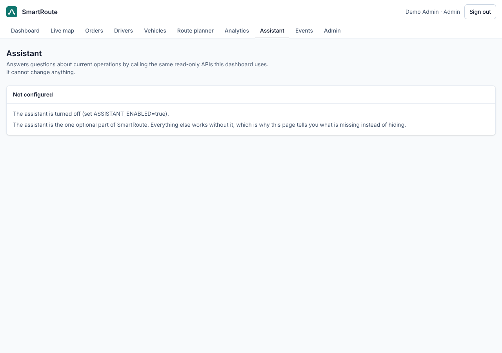

# Phase 14: The optional assistant — tool calls, three sections, and no way to write

> **Status of the numbers in this document.** Nothing here was measured against the real model API. The
> assistant has never been run with a live API key in this environment, and no key is committed anywhere.
> Everything below was verified against recorded model replies, against a local HTTP server returning recorded
> Messages API bodies, and against the real database. Where a figure would need a live call — what an answer
> costs, how often the model picks the right tool — this document says so instead of guessing.

## STEP 1: What we built

FR-24, the one optional requirement: an assistant that answers questions about current operations by calling
the system's own read-only APIs, and that separates what it measured from what it suggests.

- `POST /api/assistant/ask` takes a question and returns an answer in three parts: FACTS, RECOMMENDATIONS,
  UNCERTAINTY — plus every tool call it made, how long each took, and what the question cost in tokens.
- `GET /api/assistant/status` says whether the feature is configured, why not when it is not, and which tools
  it has. The Assistant page asks this first and hides the input box when the answer is no.
- Six read-only tools: `list_warehouses`, `find_orders`, `order_detail`, `rank_drivers_for_order`,
  `analytics_overview`, `fleet_positions`.
- The feature is off by default. It needs both `ASSISTANT_ENABLED=true` and `ANTHROPIC_API_KEY`; with either
  missing, the application starts normally, every other endpoint works, and asking a question returns 503 with
  the name of the missing setting.



That screenshot is the page as shipped: configured off, saying which setting is missing. There is no screenshot
of an answer, because producing one would mean spending money on a live API call.

## STEP 2: Architecture

```
AssistantController  ──►  AssistantLimiter (10 questions per user per minute)
        │
        ▼
AssistantService ── the loop ──────────────────────────────────────────┐
        │                                                              │
        │  ask ──► ModelTurn{text, toolCalls}                          │
        │            │                                                 │
        │            ├─ for each call: AssistantTool.call(ToolArgs)    │
        │            │        │                                        │
        │            │        └─► WarehouseService / OrderService /    │
        │            │            CandidateService / AnalyticsService /│
        │            │            LivePositions   (all read-only)      │
        │            │                                                 │
        │            └─ respond(toolOutputs, note?) ──► next ModelTurn ┘
        ▼
AnswerSections.parse  ──►  Answer{facts, recommendations, uncertainty, text, toolCalls, usage}
```

`AssistantModel` is an interface. Everything that knows about a model vendor lives in one class behind it
(`AnthropicAssistantModel`, the official Anthropic Java SDK). Tests replace that interface with a script.

The loop is nine lines of control flow: ask, run the tools it asked for, send the results back, repeat until it
answers or until it has used its configured rounds. Everything interesting is in what it refuses to do.

## STEP 3: Design decisions explained

### 3.1 The tools cannot write, and the build proves it

The model is told it can only read. That is prompt text, and prompt text is a request, not a guarantee. The
guarantee is that there is no tool that writes, and an architecture test that fails the build if one appears:
no class under `com.smartroute.assistant.tools` may call a method in `com.smartroute` named `save`, `delete`,
`create`, `update`, `cancel`, `assign`, `transition`, `setActive`, `changeStatus`, or any of the other names a
write is spelled with in this codebase. The rule was checked by making it fail on purpose before it was kept.

So the worst a prompt injection in a customer address can achieve is a wrong sentence. It cannot cancel an
order, because nothing reachable from here can.

### 3.2 A tool that fails is a message to the model, not a 500

Bad arguments — a status that does not exist, an order code that is not an order, a 400-day window — throw
`ToolArgumentException`, which the loop turns into a tool result marked as an error with the reason in it. The
model reads it and corrects itself. Any other exception becomes the exception's type and nothing else: a
message can carry a SQL fragment or an internal id, and the model's answer is shown to a user.

### 3.3 Rounds are capped, and the cap is visible in the answer

Each tool round is a paid request. After the configured number (six by default), the tool results go back with
one extra instruction: this was your last call, answer with what you have, and say under UNCERTAINTY that you
stopped early. The answer carries `toolLimitReached`, and the page prints it. A model that quietly ran out of
budget looks exactly like a model that was confident.

### 3.4 Three sections, parsed, with a working failure mode

FACTS, RECOMMENDATIONS and UNCERTAINTY are parsed out of the answer and rendered as three separate blocks, so a
suggestion cannot be read as a measurement. The parse is forgiving about how the headings are written and
strict about whether all three are there: if one is missing it reports `sectionsParsed: false` and the page
shows the model's text verbatim rather than a confident-looking parse of a shape that was not there.

Why not structured output (JSON), which cannot fail to parse? Because the sections are prose a dispatcher
reads, and a model writing into three named sections writes better prose than one filling in a schema. The
parse exists to style the answer, not to constrain the model — so a parse failure must degrade to showing
more, not less.

### 3.5 Numbers travel with their definitions, and simulations stay labelled

`analytics_overview` returns the Phase 12 `definitions` list untouched, and the prompt requires the definition
to be quoted with the number. `fleet_positions` returns each position's source and a count by source, and the
prompt requires the answer to say when positions are `SIMULATION`. `rank_drivers_for_order` returns the
ranking's own `algorithm` string, which already says `[HEURISTIC]`. The labelling this project does everywhere
else does not stop at the assistant.

### 3.6 Disabled is a first-class state

No key means no bean, which means the service reports the feature as off and `ask` returns 503 naming the
missing setting. The alternative — building a client with a blank key — turns a configuration mistake into an
error nobody sees until a dispatcher asks a question. A boot of the real application with the feature off logs
one line: `Assistant disabled: smartroute.assistant.enabled is false`.

### 3.7 Staff only, and rate limited

A viewer can read every number the assistant can read, through the pages, and still may not ask it: this is the
only endpoint in SmartRoute that costs money per call. Ten questions per user per minute, by the same token
bucket the route optimizer uses — more than a person asks, far less than a loop.

### 3.8 The transcript is append-only

Each assistant reply is sent back as the response object the API returned, not rebuilt from its text. On
current models a reasoning block belongs to the conversation that produced it, and rewriting earlier turns
invalidates it. Thinking is left at the model's default and depth is set with effort instead
(`ASSISTANT_EFFORT`), because the model this is written against does not accept a thinking budget at all.

## STEP 4: Contracts

| Endpoint | Role | Returns |
|---|---|---|
| `GET /api/assistant/status` | ADMIN, DISPATCHER | `{enabled, reason, model, tools[]}` |
| `POST /api/assistant/ask` | ADMIN, DISPATCHER | `{facts[], recommendations[], uncertainty[], text, sectionsParsed, toolCalls[], toolRounds, toolLimitReached, model, usage}` |

Errors: `400 VALIDATION_FAILED` (empty question, or over 1000 characters), `429 RATE_LIMITED`,
`503 FEATURE_NOT_CONFIGURED` (with the missing setting named), `502 UPSTREAM_FAILED` (the model API could not
be reached; the provider's own message is logged, never returned).

Settings: `ASSISTANT_ENABLED`, `ANTHROPIC_API_KEY`, `ASSISTANT_MODEL`, `ASSISTANT_EFFORT`,
`ASSISTANT_MAX_TOOL_ROUNDS`, `ASSISTANT_MAX_TOKENS`. All in `.env.example`; the key is never logged and never
returned by any endpoint.

## STEP 5: Tests (418 backend, 77 frontend; 30 + 5 new)

| Test | What it pins down |
|---|---|
| `AssistantServiceTest` (6) | The loop, driven by recorded replies: a tool call recorded and answered; bad arguments handed back as a failed result; a tool that does not exist answered with the list of ones that do; the round cap reached, with the note sent only on the last round; an answer that ignores the three sections kept whole; a question refused when the feature is off |
| `AnthropicAssistantModelTest` (1) | The SDK adapter against a local server returning recorded Messages API bodies: tool calls and text mapped both ways, the tool definition and system prompt on the wire, the assistant turn replayed unchanged, no thinking budget sent |
| `AssistantToolsTest` (10) | Each tool against a real database: counts and filters, an order with its history, a ranking that explains why nobody is eligible, positions counted by source, analytics with definitions, and the two argument errors |
| `AssistantApiTest` (5) | The default deployment: status says off and why, asking is 503, an empty or over-long question is 400, viewers and drivers are 403, anonymous is 401 |
| `AssistantAnswerApiTest` (3) | The whole endpoint with a configured assistant and a recorded conversation: the tool really runs against the database, the model sees its output, the answer arrives in sections with the tool call listed, and the eleventh question in a minute is refused |
| `AnswerSectionsTest` (4) | The parser, including Markdown headings, numbered lists, a missing section, and text before the first heading |
| `ArchitectureTest.assistantToolsOnlyRead` | No tool can call a write |
| `AssistantPage.test.tsx` (5) | The page: the off state names the setting, the three blocks stay separate with the tool calls listed, an unparsed answer is shown as written, the tool-limit warning appears, an empty question asks nothing |

Not tested, and not claimable: whether the model picks the right tool for a given question, how good its
answers are, and what one question actually costs. All three need live calls.

## STEP 6: Checked against the running stack

| What | Result |
|---|---|
| Application boots with the assistant off | Yes — one log line naming the reason, every other endpoint unaffected |
| Assistant page in the default deployment | Shows "Not configured" and the missing setting (screenshot above) |
| Nav link hidden from viewers and drivers | Yes — the route and the link both require ADMIN or DISPATCHER, and the endpoint enforces it |
| Backend suite | 418 tests, green (`./mvnw verify`) |
| Frontend suite, build, lint | 77 tests, `tsc -b` and `vite build` clean, oxlint clean |
| A live question against the real API | **Not run.** No key, and no number in this document depends on one |

## STEP 7: Review notes

- The question limit (1000 characters) is a cost control and reduces, but cannot remove, the room for
  instructions aimed at the model. The read-only tool surface is what actually bounds the damage.
- Tool calls in one round run sequentially, not concurrently. They are database reads on the same pool as every
  other request; one question holding several connections to save a hundred milliseconds is a bad trade here.
- The prompt-cache breakpoint on the system prompt may do nothing: whether a prefix is long enough to cache is
  the API's call. `usage.cacheReadTokens` is reported so that it can be observed rather than assumed.
- `find_orders` returns summaries, not whole orders. `order_detail` is one more call away, and sending twenty
  full records would be paying for fields nobody asked about.
- The assistant sees customer names and addresses, because orders have them and dispatchers see them. All of it
  is fictional seed data; no real personal data exists in this project.

## Interview questions

1. The assistant is told it cannot change anything. Why is that sentence not the security control, and what
   is?
2. A tool is called with a status that does not exist. Walk through what happens, and explain why that is
   better than returning a 400 to the caller.
3. Why is each assistant reply sent back to the API as the response object rather than as its text?
4. What is the difference between `maxTokens` and the tool-round cap, and which one stops a runaway loop?
5. The answer is parsed into three sections. What happens when the model ignores the format, and why does the
   page show more rather than less in that case?
6. Why does a VIEWER, who can read every number the assistant reads, get a 403 here?
7. The feature needs both a flag and a key. What would break if it only needed the flag?
8. Where in this design could a prompt injection hidden in an order's address do damage, and where is it
   stopped?
9. Analytics results carry a `definitions` list. Why does the assistant quote it instead of just the number?
10. What would you have to build to claim "the assistant answers operational questions accurately", and why
    does nothing in this phase claim it?
